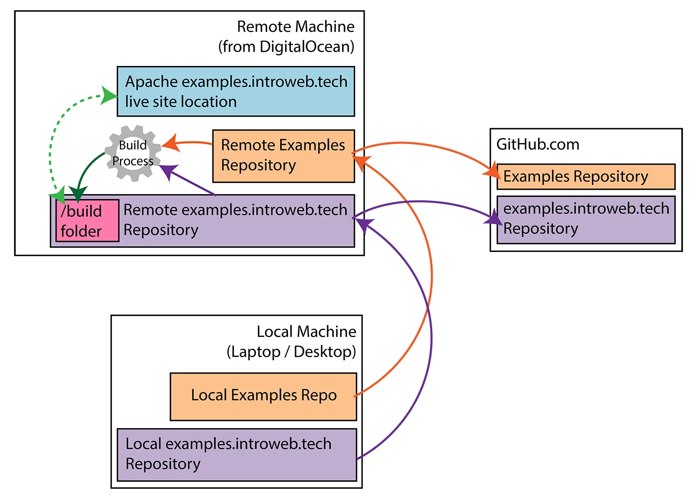

# Examples

The repo of example demos that the introweb.tech website pulls from.

Live at [https://introweb.tech/examples](https://introweb.tech/examples).

The repo for [introweb.tech/examples](https://introweb.tech/examples) (same as the [examples.introweb.tech](https://examples.introweb.tech) site/repo) can be found [here](https://github.com/iwtbook/examples.introweb.tech).

## Table of Contents

1. [How to Read this Repo](#how-to-read-this-repo)
   1. [`_repo-apis`](#repo-apis)
   2. [Main Category Directories](#main-category-directories)
   3. [`root-dir-config.json`](#root-dir-configjson)
   4. [General Repo Files](#general-repo-files)
2. [How to Contribute](#how-to-contribute)
3. [Continuous Deployment](#continuous-deployment)

## How to Read this Repo

Upon first glance there are a few different things you'll notice in this repo:

- A directory that starts with an underscore (_repo-apis)
- A bunch of category directories (asynchronous, communications, etc)
- A file called `root-dir-config.json`
- The basic `.gitignore` and `README.md` files

We'll start with `_repo-apis`

### `_repo-apis`

This directory is where all of the APIs and build scripts live. The APIs are prefixed with `api-` while the build scripts are prefixed with `build-`.

<dl>
  <dt>Content API</dt>
  <dd>This is the largest API. Started as a mimic of the GitHub API to easily access the code in this repo in a digestible manner, but has grown more features. See full API table below.</dd>

  <dt>Zip API</dt>
  <dd>Designed to return a zip download file of any demo in this repository. User-centered so ignores files irrelevent to the demo (like `quiz.md` and such)</dd>

  <dt>Sidebar Build Process</dt>
  <dd>All of the sidebars for each main category (asynchronous, communications, etc) are pre-generated on build and placed in the top level of each main category in a file called `sidebar.html`. This script creates and updates those files.</dd>
</dl>

### Content API
<table>
  <thead>
    <tr>
      <th>Method</th>
      <th>Route</th>
      <th>Query Params</th>
      <th>Returns</th>
      <th>Description</th>
      <th>Example</th>
    </tr>
  </thead>
  <tbody>
    <tr>
      <td><code>GET</code></td>
      <td><code>/:repo</code></td>
      <td><code>dir</code> (optional - the desired subdirectory. Defaults to every subdirectory.)</td>
      <td>Object&lt;Array&gt;</td>
      <td>All of the file paths for every file (and a URL to reach the file contents at) in the specified repo. In no particular order.</td>
      <td><code>GET /examples?dir=html</code></td>
    </tr>
    <tr>
      <td><code>GET</code></td>
      <td><code>/:repo/demos</code></td>
      <td><code>dir</code> (optional - the desired subdirectory. Defaults to every subdirectory.)</td>
      <td>Array&lt;String&gt;</td>
      <td>A list of every demo in the specified repo. In no particular order.</td>
      <td><code>GET /examples/demos?dir=html</code></td>
    </tr>
    <tr>
      <td><code>GET</code></td>
      <td><code>/:repo/demo-frames</code></td>
      <td>none</td>
      <td>Array&lt;String&gt;</td>
      <td>A list of every demo and what frames they use (e.g. markdown, editor, etc). In no particular order.</td>
      <td><code>GET /examples/demo-frames</code></td>
    </tr>
    <tr>
      <td><code>GET</code></td>
      <td><code>/:repo/file/*</code></td>
      <td>none</td>
      <td>Object</td>
      <td>The contents and metadata of the specified file from the specified repo. Must be a relative route to a file (e.g. `form/spa/index.html`)</td>
      <td><code>GET /examples/file/form/spa/index.html</code></td>
    </tr>
  </tbody>
</table>

### Main Category Directories

`TODO`

### `root-dir-config.json`

`TODO`

### General Repo Files

`TODO`

## How to Contribute

`TODO`

## Continuous Deployment (CD)

The above diagram illustrates the continuous deployment process of this repository. The process starts on your local machine.

1. On your local machine changes are made to either the [examples](https://github.com/iwtbook/examples) repo (by adding / modifying a demo) or the [examples.introweb.tech](https://github.com/iwtbook/examples.introweb.tech) repo
2. The git origin is then set to the corresponding bare repository on the DigitalOcean droplet
   * `git@introweb.tech:/var/repos/bare/examples.git`
   * `git@introweb.tech:/var/repos/bare/examples.introweb.tech.git`
3. The changes are pushed to the remote machine
4. Both repos have a `post-receive` hook that then pushes those changes to GitHub and triggers the build process after changes are pushed
   1. The hook first pushes the changes to GitHub
   2. Then, if the changes came from the [Examples](https://github.com/iwtbook/examples) repo, the hook first runs `build-sidebar.js` to generate all of the `sidebar.html` pages
   3. Then the hook removes the old `/dist` folder from the `examples.introweb.tech` repo
   4. Finally, the hook initiates the build process for `examples.introweb.tech` which creates a new `/dist` folder
5. The `examples.introweb.tech` DocumentRoot has been set up to live at `/var/www/examples.introweb.tech` within Apache on the remote server. The actual file at `/var/www/examples.introweb.tech` is a symbolic link to `/var/repos/examples.introweb.tech/dist` so creating the new `/dist` folder automatically deploys the updates live. (This is the dashed green arrow in the diagram)