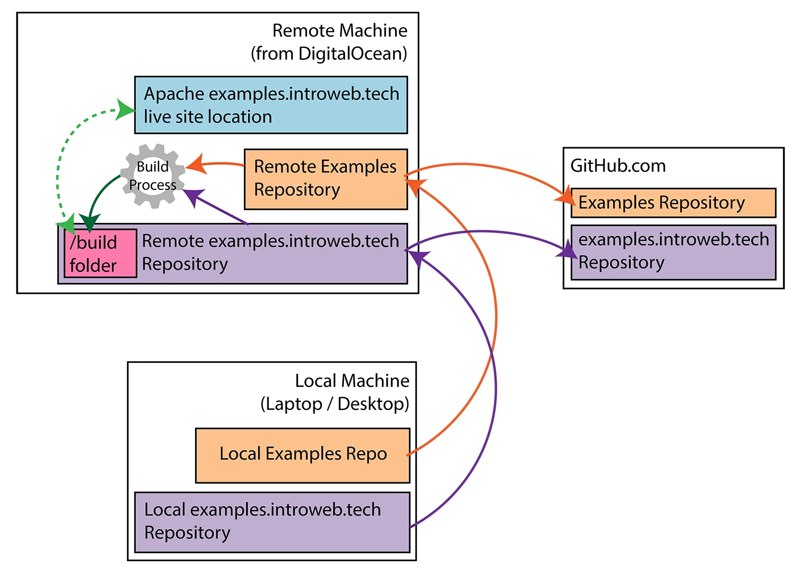

# Examples

The repo of examples that the introweb.tech website pulls from.

Live at [https://introweb.tech/examples](https://introweb.tech/examples)

## How this repo is Continuously Deploying (CD)

## How to read this repo

Upon first glance there are a few different things you'll notice in this repo:

- A directory that starts with an underscore (_repo-apis)
- A bunch of category directories (asynchronous, communications, etc)
- A file called `root-dir-config.json`
- The basic `.gitignore` and `README.md` files

We'll start with `_repo-apis`

### `_repo-apis`

This directory is where all of the APIs and build scripts live. The APIs are prefixed with `api-` while the build scripts are prefixed with `build-`.

<dl>
  <dt>Content API</dt>
  <dd>This is the largest API. Started as a mimic of the GitHub API to easily access the code in this repo in a digestible manner, but has grown more features. See full API table below.</dd>

  <dt>Zip API</dt>
  <dd>Designed to return a zip download file of any demo in this repository. User-centered so ignores files irrelevent to the demo (like `quiz.md` and such)</dd>

  <dt>Metadata Build Process</dt>
  <dd>This is the largest API.</dd>

  <dt>Sidebar Build Process</dt>
  <dd>All of the sidebars for each main category (asynchronous, communications, etc) are pre-generated on build and placed in the top level of each main category in a file called `sidebar.html`. This script creates and updates those files.</dd>
</dl>

## Contributing

f
